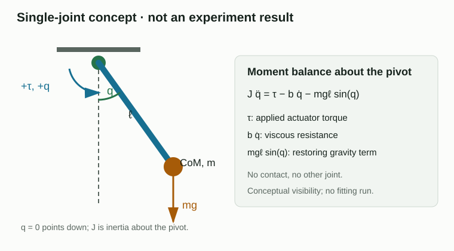
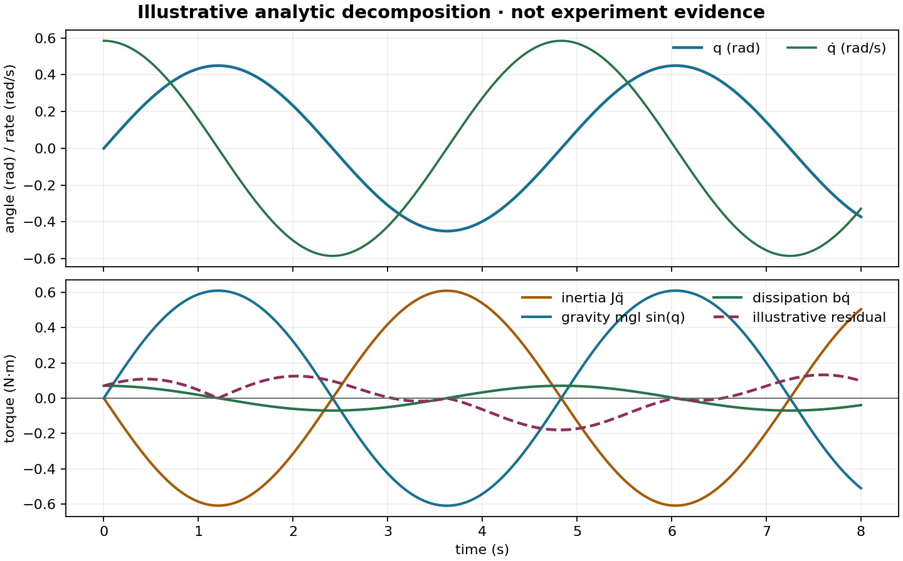

# K2 · 从运动偏差定位动力学项

模型可能在一个姿态有效，机器人移动后却失败。先停在这个失配上：观察残差，预测运动的哪个变化会让它变大或变小。本课提供一种实用方法，把这个模式连接到候选动力学项，同时承认一条曲线不能唯一识别一个原因。

方程是提出问题的地图，不是保证每个质量、质心或惯量都能通过一次实验恢复。

本页中，**Student** 指正在拟合的模型，**Oracle** 指生成参考运动的系统。**诊断信号**可以被 Oracle 或讲解使用，但被排除在 Student 的拟合目标之外。

## 同一个拟合不会在所有地方都有效 {#failure}

想象一个支撑着的机械臂模型在某个角度附近预测很好，但经过另一个角度时就出现偏差。先预测：偏差会随位置、速度、加速度还是接触改变？一个直觉反应是调整惯量直到新曲线重合，但这样会在弄清楚变化之前就消耗证据。

先预测缺少重力项时会出现什么模式，再预测惯量低估时会出现什么模式。两者都可能造成位置误差，但它们对姿态和加速度的响应应当不同。

## 画出系统边界和各项 {#boundary}

对机器人机构，先画出边界，再选择参数。一个有用的动力学边界是

$$
M(q)\ddot q + C(q,\dot q)\dot q + g(q) + \tau_f = \tau + J_c^T\lambda.
$$

其中 $M$ 描述惯量，$C\dot q$ 汇总速度相关耦合，$g$ 是重力，$\tau_f$ 表示摩擦或其他耗散，$J_c^T\lambda$ 是接触产生的广义力。只有当执行器边界让实际力矩可观测或已知时，实际施加力矩 $\tau$ 才位于输入侧。

在单关节示意中，若高度为 $h=\ell(1-\cos q)$，则势能为 $U=mgh$，因此 $\partial U/\partial q=mg\ell\sin q$。加入黏性耗散 $\tau_f=b\dot q$ 后，平衡式为

$$J\ddot q=\tau-b\dot q-mg\ell\sin q.$$

单位可以快速检查推导：$J$ 的单位是 kg·m²，$\ddot q$ 是 rad/s²，两边每一项都应是 N·m（弧度无量纲）。沿同一条声明的运动，定义力矩残差 $\varepsilon=\tau_{\mathrm{model}}-\tau_{\mathrm{reference}}$。这是力矩平衡诊断，与 L0 的轨迹残差不同。这里的分解只是示意，不声称存在观测或拟合结果。

下面的图使用 $q(t)=0.45\sin(1.3t)$ rad、$J=0.8$ kg·m²、$b=0.12$ N·m·s/rad 和 $mg\ell=1.4$ N·m，导数直接解析求得。虚线残差是为读图练习指定的占位曲线 $0.18\sin(0.9t+0.4)|\dot q|/0.585$ N·m，没有归因于某种物理机制。使用 `python docs/lessons/k2/assets/generate_concept_figures.py` 可以重建示意图。它是**概念示例，不是实验运行记录**。

| 候选项 | 主要线索 | 有用的变化 |
|---|---|---|
| 惯量 | 加速度与频率 | 固定姿态，改变加速度 |
| 重力 | 姿态与方向 | 在不同角度重复运动 |
| 耦合 | 另一关节的运动 | 激励一个关节并观察另一个 |
| 摩擦 | 速度与方向，尤其是换向 | 多种速度和方向重复 |
| 接触 | 接触事件与负载 | 比较自由空间与受控接触 |

线索可以缩小假设范围，但不会自动选出唯一原因。

## 用受控变化区分各项 {#comparison}

固定机构、控制器和观测处理，每次只改变一个条件：

1. 固定姿态附近，改变加速度以显现惯量；
2. 在另一个方向或姿态重复，显现重力；
3. 保持或移动另一关节时激励一个关节，显现耦合；
4. 只有自由空间证据合格后，才比较自由空间与接触运动。

完整的刚体方程不意味着应该一次拟合所有项。固定机构、控制器、观测处理和拟合预算，每次只改变一个已声明的条件。Student 只能包含数据能够支持的参数。如果多个项总是一起变化，就报告参数组合，或设计新的实验。

## 阅读各项分解与残差 {#evidence}

有用的**概念图或诊断图**会把候选力矩项和残差画在同一时间轴上。如果这些项来自 Oracle，它们就是诊断信息；只有课程明确声明时，Student 才能看到它们。按以下顺序阅读：

- 该项在出现残差的条件下是否足够大？
- 改变相关条件后，残差是否按预期方向变化？
- 同一个调整是否破坏了原本通过的条件？
- 该项对拟合器可见，还是只属于 Oracle 诊断信号？

各项分解解释的是仿真真值。除非课程明确声明可见，否则它们不是 Student 可以使用的观测。L2 中，隐藏的真实连杆参数和内部力仍然只用于评估或诊断。

## 想一想 {#exercise}

先读页面上的图：在 $t=1.2$ s 附近，角度到达转折点。哪个力矩项接近零？为什么另外两项仍可以很大？虚线是否证明遗漏了耦合项？

再考虑这样一个两关节情景：第 2 关节残差在第 1 关节加速时变大；第 1 关节慢速运动时，残差很小。你先测试哪个候选原因？用什么后续运动区分耦合与执行器延迟？

把上面的概念图作为检查：彩色曲线展示了不同项可能具有不同相位，但力矩单位相同，但它们本身不能识别隐藏原因。回答练习时，要指出改变了哪个信号、哪个项因此变得合理，以及哪一个受控对比会让候选解释给出不同预测。

查看参考思路

在转折点速度为零，因此黏性阻力 $b\dot q$ 接近零。加速度与非零角度使惯量项和重力项仍然明显。虚线是人为指定的解析曲线，不能证明遗漏任何物理效应。

对于两关节情景，先测试耦合或加速度相关假设，因为残差跟随另一个关节的加速度。保持指令时序相近，但改变第 1 关节的加速度曲线，比较同步的相位或频率视图。如果改变加速度后残差仍严格跟随相对指令的时序，延迟仍然合理；如果它在时序变化后仍跟随耦合运动，则耦合更有支持。

如果还不能判断，先把残差与关节 1 的加速度对齐，再只改变它的加速度曲线并重复比较。当你能说清楚哪一个观察会让延迟和耦合给出不同预测时再继续；一次运动中残差更小还不够。

## 这个方程不能告诉我们什么 {#limits}

方程用于组织假设，不能保证实际可辨识性。接触、执行器、几何和观测误差可能互相补偿。某个姿态的拟合变好，可能得到的是等效模型，而不是恢复了真实物理参数。

K3 会把边界缩小到从控制指令到关节力矩的链路。L2 稍后会在固定基座腿中使用姿态和耦合变化。继续阅读 [K3 · 从控制指令追踪到关节力矩](../k3/index.zh-CN.md)。
