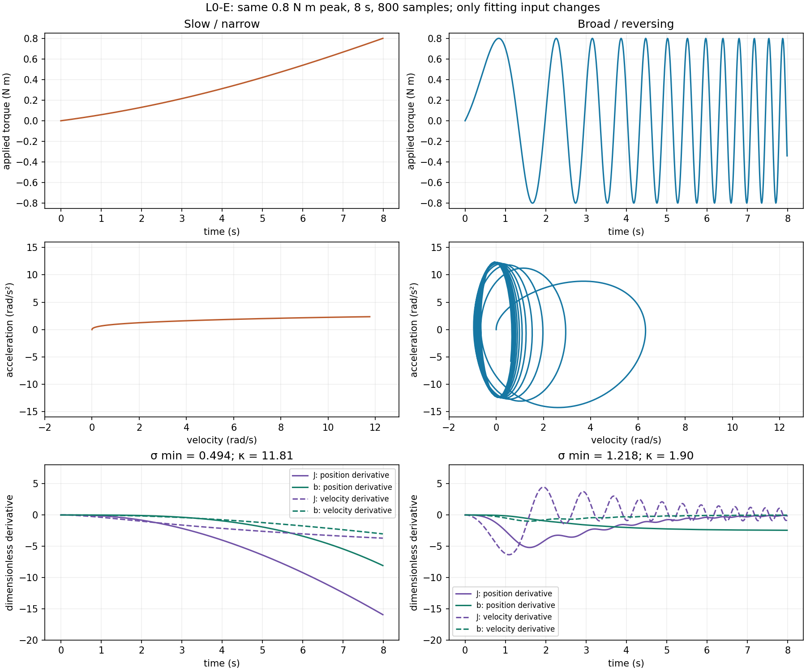
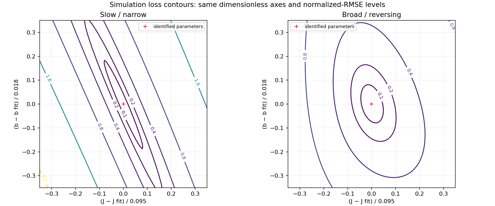

# K4 · 判断实验能否区分参数

拟合程序可能给出很小的误差，但参数仍然没有被可靠约束。本课回答：为什么会这样，以及怎样设计输入，让我们真正看到想估计的效应。

学完后，你应该能读懂敏感度对比，识别细长的损失谷，并提出更好的实验，而不是把“增加样本”当成唯一答案。

## 小误差可能掩盖大问题 {#failure}

L0 从转动关节估计惯量 $J$ 和黏性阻尼 $b$。假设拟合曲线几乎和观测重合，这是否说明两个参数都已经确定？

不一定。如果记录的运动只改变了很小的速度，$J\ddot q$ 与 $b\dot q$ 在整段数据中可能始终以近似比例出现。这样，多组参数值都能给出相似预测。优化器找到了一个行为相近的区域，但实验没有告诉我们这个区域中哪一个方向才是正确的。

在看对比结果前先预测：输入主要产生缓慢运动时会怎样；输入产生明显加速和换向时又会怎样。

## 估计器能看到什么？ {#boundary}

被辨识系统的边界沿用 L0：

实际力矩 $u$→<strong>转动关节</strong>→观测 $q$、$\dot q$

Student 模型为

$$
J\ddot q + b\dot q = u.
$$

估计器只能得到拟合输入和观测，以及预先声明的参数边界与目标函数。Oracle 参数和最终留出运动只用于评估。在这个无噪声教学案例中，信息不足表示参数效应难以分开，不是传感器噪声造成的。

一个有用的局部问题是：把 $J$ 稍微改变，预测曲线怎样变化？这种变化叫作**敏感度**。把对 $J$ 的敏感度和对 $b$ 的敏感度并排比较。如果两列在记录样本上的方向几乎相同，数据就难以区分两个参数。

## 比较输入，而不只是样本数量 {#comparison}

固定系统、幅值预算、时长预算、模型、边界、估计器和最终评估运动，只改变拟合输入：

| 拟合输入 | 能显现什么 | 风险 |
|---|---|---|
| 缓慢、窄频带运动 | 有限的速度和加速度范围 | 惯量可能没有独立影响 |
| 更宽频带并包含换向的扫频 | 更不同的速度与加速度模式 | 大幅运动可能超出目标工作范围 |

公平比较不是“哪次运行的行数更多”。要记录实际的位置、速度和加速度覆盖范围。相同的时长和幅值，并不保证相同的信息量。

最终评估运动必须在看到分数前声明。它检验输入选择是否产生了能预测新条件的模型。

## 阅读敏感度与损失谷证据 {#evidence}

这段短片回答“为什么更大的速度不等于更好的参数分离？”先看相同力矩峰值下的两种输入，再比较速度覆盖与敏感度数值。课内等高线补充展示短片中的分离结论。

<figure class="clip"><video controls playsinline poster="../../../demos/manim/rendered/l0-excitation.png" preload="metadata"><source src="../../../demos/manim/rendered/l0-excitation.mp4" type="video/mp4"/><track kind="subtitles" label="English" src="../../site/subtitles/l0-excitation.en.vtt" srclang="en"/><track default kind="subtitles" label="中文" src="../../site/subtitles/l0-excitation.zh-CN.vtt" srclang="zh-CN"/></video><figcaption>哪种输入更能分开效应？</figcaption>

查看视频说明

两次使用相同的力矩峰值、时长、模型、尺度和留出运动，只改变拟合激励。

慢输入的损失谷更长；宽频输入有清楚的加速度换向和更好的局部 Jacobian 条件。

两次无噪声拟合都恢复并通过留出预测。敏感度较弱提示改进实验，不等于优化失败。

</figure>

L0-E 运行现在提供了对应的仿真对比。两种输入都恢复了无噪声教师系统，但宽频输入更清楚地分离了局部参数效应。这不表示慢输入拟合失败。

慢记录的速度为 0…11.763 rad/s、加速度 RMS 为 1.609 rad/s²、尺度化敏感度最小奇异值为 0.494、条件数为 11.81。宽频记录的速度为 −0.953…6.324 rad/s、加速度 RMS 为 8.470 rad/s²、最小奇异值为 1.218、条件数为 1.90。两者使用相同的 8 s、0.8 N m 峰值预算。输出尺度固定为 1 rad、1 rad/s，参数尺度固定为公开初始模型的 0.095、0.018；敏感度矩阵除以 √(2N) 后计算奇异值。图中紫色代表 J、绿色代表 b，实线对应位置、虚线对应速度；两组使用同一纵轴。应把宽频输入理解为当前契约下局部分离更好，同时注意它产生了不同的状态覆盖。

慢输入的细长损失谷和宽频输入的紧凑等高线来自同一个尺度化残差目标。18 个声明起点都恢复 J = 0.065、b = 0.055，因此没有把弱损失谷写成虚构的优化失败。同一份留出多正弦对两种拟合的位置 RMSE 约为 2.4 × 10⁻¹⁴ rad。参阅[可复现报告](../../../reports/l0_excitation/report.zh-CN.md)，并运行 `python -m synthetic.l0_excitation --output-dir reports/l0_excitation`。

三种视图回答不同问题：

1. **覆盖范围：** 两种输入是否真的产生了不同的 $\dot q$ 与 $\ddot q$ 范围？
2. **敏感度：** 在这些样本上，$J$ 和 $b$ 引起的输出变化是否可区分？
3. **损失面：** 遍历多个 $(J,b)$ 组合时，低损失区域是紧凑的，还是细长的谷？

细长的谷说明在这次实验中，一族参数组合表现相近。它本身不能证明参数在结构上无法辨识。新的输入、新的姿态、独立测量或不同的系统边界，都可能切开这条谷。

多个初始点的拟合结果可以说明这次运行的优化行为。多个初始点落在同一条谷里，不等于所有实验都能恢复同样的物理值。

## 想一想 {#exercise}

只看上面的仿真图：左列与右列哪一份包含正负加速度？在同一条 0.2 等高线上，哪条谷更细长？把它与条件数 11.81 和 1.90 对应起来。

接着核对报告中的 18 个起点与共同留出预测：能否声称慢输入不可辨识，或者宽频输入的预测误差显著更小？下一次若要增加抗扰余量，你会优先改变什么？

查看参考思路

右列宽频输入包含正负加速度；左列慢输入的 0.2 等高线更细长，对应较高条件数 11.81。优先考虑能增加独立加速度变化的激励，并核对实际状态约束。两种输入都恢复且留出误差约为 2.4 × 10⁻¹⁴ rad，所以不能声称慢输入不可辨识，也不能用浮点量级差异排序预测性能。紧凑损失区域支持局部分离较好，不是噪声鲁棒性实验、全局唯一或硬件迁移的证明。

如果根据留出结果选择频带或重新调整目标函数，这份数据就成为开发数据。要支持新的最终结论，需要另外保留独立评估集。

不要靠增加相邻样本来修复细长的损失谷。如果还不能选择，检查缩放后的敏感度列，并说明哪个新条件会让其中一列转向。当提出的输入改变了信息而不只是样本数量时再继续。

## 这个实验不能告诉我们什么 {#limits}

本对比研究的是匹配、无噪声的单关节模型中的实际信息。它不能证明全局唯一解，不能量化硬件传感器不确定性，也不能判断是否存在缺失物理效应。更好的激励之后仍出现结构化残差，也可能有多种解释。

下一课解释优化器如何使用预先声明的目标函数，以及为什么停止状态只能说明拟合过程，不能证明模型正确。

继续阅读 [K5 · 理解拟合过程实际解决了什么](../k5/index.zh-CN.md)。
