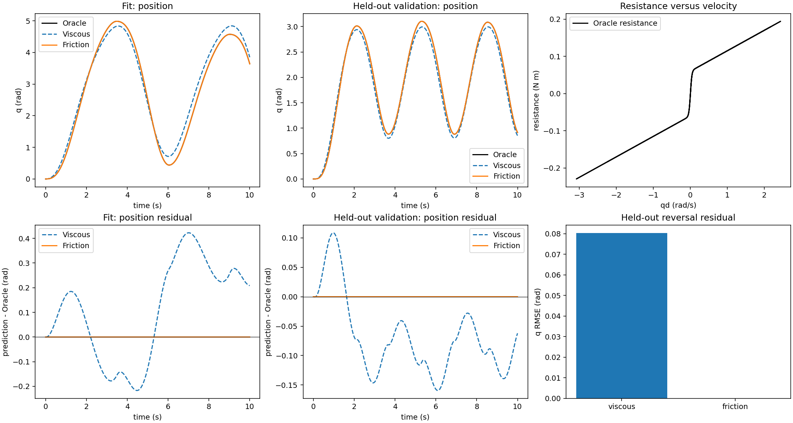

# K7 · 判断拟合参数代表什么

一个拟合值可能改善预测，却不代表你原本想测量的物理量。本课给这些情况命名，并展示怎样通过改变条件，检查参数含义是否仍然成立。

有时应该报告范围、参数组合或等效值。当证据支持这样的结论时，它同样是有效的系统辨识结果。

## 两组参数可以拟合同一段运动 {#failure}

假设 Student 忽略了一个小延迟。增大阻尼、改变力矩比例，可能在拟合运动上部分补偿这个遗漏。两组参数都看起来合理，但它们回答的是不同的物理问题。

比较参数前先预测：在新的频率、姿态、方向或负载下，补偿解会怎样。如果含义是物理的，换条件后同一个量仍应有稳定解释；如果它是等效的，遗漏效应改变时它的数值也可能改变。

## 给参数划定语义边界 {#boundary}

使用以下四个标签：

| 标签 | 含义 | 能支持的结论 |
|---|---|---|
| 物理参数 | 在声明边界内有独立意义的属性 | 若可辨识，可与独立参考值比较恢复误差 |
| 等效参数 | 吸收遗漏效应、改善预测的值 | 在声明工作范围内的预测 |
| 干扰参数 | 解释观测所需，但不是下游目标 | 更好的拟合或修正，不是物理解释 |
| 不确定参数 | 范围比单点更重要的量 | 在范围内做稳健决策 |

标签属于参数**及其边界**。固定控制器输出端估计出的延迟，不自动是电机电磁时间常数。没有摩擦项的模型中，阻尼值可能吸收测试速度附近的阻力。

## 跨条件检查参数含义 {#comparison}

固定公开拟合数据，比较匹配 Student 和缺项 Student，再在拟合前选定的条件下评估：

1. 用相同目标函数和边界拟合两种结构；
2. 记录哪些参数一起变化、哪些参数撞到边界；
3. 在遗漏效应应当显现的新条件下评估；
4. 报告参数解释和预测是否稳定。

独立的部件约束可以缩小补偿谷，但也改变边界和数据成本。它应计入路线比较，而不是被当作免费信息。

## 阅读参数证据 {#evidence}

参数对比在所声明条件产生并核验记录前属于概念内容。稳定的标签是带边界的结论，不能单独当作实测事实。

一起看参数对损失图、不同条件下的拟合值和预测结果。参数稳定但留出行为很差，不是成功；等效参数变化但预测稳定，可能仍然有用，只要明确它的范围和边界。

只有语义一致且信息充分的参数才支持恢复误差。对于 Oracle/Student 不匹配的效应，应报告行为、残差和工作范围。局部优化器曲率不能完整描述模型失配下的不确定性。

下面是已经运行的 L1 摩擦对比，不是上面延迟例子的实测结果。两种 Student 使用相同的已知力矩、理想观测、固定惯量和拟合数据；一个只拟合黏性阻尼，另一个同时拟合黏性阻尼与平滑类库仑阻力。

| 模型 | 拟合 $b$（N m s/rad） | 拟合 $\tau_c$（N m） | 参数解释 |
|---|---:|---:|---|
| 纯黏性 | 0.097292 | 固定为 0 | $b$ 吸收缺失阻力，是该模型边界下的等效值 |
| 含摩擦 | 0.055000 | 0.060000 | 在匹配、无噪声的合成案例中恢复参考值 |

先看阻力—速度曲线，再看留出残差：纯黏性模型改变了斜率，却不能复现弯曲的阻力关系。表中的两组参数及图来自[冻结报告](../../../reports/l1_friction/report.zh-CN.md)。这支持“漏掉摩擦时阻尼会补偿误差”；本次运行没有逐个速度重新拟合，因此不能据此声称已经测量了 $b$ 随速度变化的规律。

## 想一想 {#exercise}

一个没有摩擦的 Student 通过增大阻尼拟合低速运动。在更高速的换向中，残差出现方向性，拟合出的阻尼也改变。原来的阻尼值应该怎样报告？什么实验能减少歧义？

查看参考思路

应把阻尼报告为“无摩擦边界下、低速范围内的等效值”，不能称为独立恢复的物理阻尼系数。增加双向、多速度运动以显现遗漏的阻力；如果实际力矩/阻力测量属于目标边界，也可以加入独立测量。如果用同一次评估运行选择丰富模型，就需要另留最终运行。

常见误区是在检查边界前就给数值贴上物理名称。如果还不能分类，比较新条件下的参数值和预测，再报告组合或范围。当标签同时写出证据和限制时再继续。

## 参数标签不能证明什么 {#limits}

把一个值叫作“物理参数”不会让它自动可辨识；叫作“等效参数”也不代表它没有用。结论必须说明边界、数据、条件和标签背后的独立证据。

L2 会把这些原则用于耦合腿中的执行器与刚体补偿。继续阅读 [L2 · 在固定基座腿中分离执行器与刚体误差](../l2/index.zh-CN.md)。
