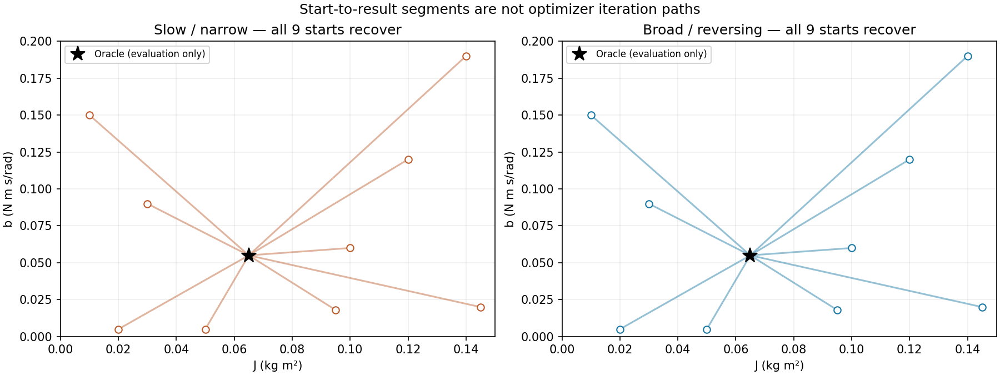

# L0-E · When input hides a parameter's effect

L0 shows that a matched model can recover inertia and damping from informative motion. This companion experiment asks the harder question: can a large dataset still leave a parameter weakly constrained when the input does not reveal its effect?

The frozen runner and report now provide this comparison. Both fits recover the noiseless teacher, while the broad input gives a better-conditioned local sensitivity. This is evidence about this matched setup, not a guarantee that a slow input fails or that hardware will transfer.

## More rows do not guarantee more information {#failure}

Imagine collecting a long, slow motion near one speed. The fitting loss may be small because the model predicts that narrow behavior well. Yet inertia appears through acceleration, while viscous damping appears through velocity. If acceleration barely changes, many parameter combinations can remain plausible.

Predict what a wider-band input with reversals should change. It may separate the effects, but it can also leave the intended operating range. Information and safety are both experiment-design constraints.

## Keep the L0 boundary fixed {#boundary}

Reuse the matched L0 plant:

$$
J\ddot q + b\dot q = u.
$$

The fitting input and ideal $q,\dot q$ observations are public. The Student, estimator, bounds, objective scaling, initial state, and final held-out multisine are fixed across the comparison. Only the fitting excitation changes. Oracle parameters remain evaluation-only.

This isolation matters. Adding noise, changing the estimator, or widening the model at the same time would make an observed difference ambiguous.

## Compare slow and broadband excitation {#comparison}

Use the same declared amplitude and duration budget:

| Fitting excitation | Expected information | What to record |
|---|---|---|
| Slow/narrow-band input | Small acceleration variation | velocity and acceleration coverage |
| Wider-band sweep with reversals | More independent velocity/acceleration patterns | frequency, state coverage, and command range |

Score both fits on the same final held-out multisine, chosen before seeing either result. Report the actual state coverage rather than assuming equal command budgets are equivalent.

Both start at q(0)=0 rad and zero velocity. The initial model is (J,b)=(0.095,0.018), with bounds J∈[0.01,0.15] kg m² and b∈[0.000001,0.2] N m s/rad. The shared L0 simulator and bounded least-squares settings receive only fitting records; held-out observations are generated after all fits finish. Presets were frozen using fit-side coverage and sensitivity, without selecting by final scores.

<figure class="clip"><video controls playsinline poster="../../../demos/manim/rendered/l0-excitation.png" preload="metadata"><source src="../../../demos/manim/rendered/l0-excitation.mp4" type="video/mp4"/><track default kind="subtitles" label="English" src="../../site/subtitles/l0-excitation.en.vtt" srclang="en"/><track kind="subtitles" label="中文" src="../../site/subtitles/l0-excitation.zh-CN.vtt" srclang="zh-CN"/></video><figcaption>Which input separates the effects?</figcaption>

Read the video explanation

The same peak torque, duration, model, scales, and held-out motion are used. Only the fitting excitation changes.

The slow input has a longer loss valley; the broad input has clearer acceleration reversals and a better-conditioned local Jacobian.

Both noiseless fits recover and pass held-out prediction. Weak sensitivity is evidence to improve the experiment, not proof of optimizer failure.

</figure>

## Read the simulation evidence {#evidence}

The report uses 800 samples at 0.01 s over 8 s, the same initial state, bounds, initial model, 0.8 N m sampled torque peak, fixed output scales (1 rad, 1 rad/s), and the same held-out multisine. The slow chirp is 0.005–0.015 Hz; the broad chirp is 0.15–3 Hz.

Position spans 0…35.608 rad for slow and 0…7.577 rad for broad. These large angles are specific to this ideal rotor without gravity or joint limits. The slow record has velocity 0…11.763 rad/s and acceleration RMS 1.609 rad/s²; the broad record has velocity −0.953…6.324 rad/s and acceleration RMS 8.470 rad/s². The smallest scaled sensitivity singular value is 0.494 for slow and 1.218 for broad; condition numbers are 11.81 and 1.90. These are local conditioning diagnostics, not uncertainty intervals.

The contours use the same dimensionless axes and the exact residual objective used by fitting. The slow surface has a longer valley; the broad surface is more compact.

All 18 declared starts converge to J = 0.065 and b = 0.055 within floating-point tolerance. The common held-out multisine position RMSE is about 2.4 × 10⁻¹⁴ rad for both fits. This is a successful noiseless recovery in both cases, so the honest lesson is that weak sensitivity can coexist with recovery when observations are ideal.

Install dependencies once with `python -m pip install -r requirements.txt`, then run the report from the repository root with `python -m synthetic.l0_excitation --output-dir reports/l0_excitation`. The [full report](../../../reports/l0_excitation/report.md) includes [raw data](../../../reports/l0_excitation/metrics.json) and the [resource record](../../../reports/l0_excitation/runtime.json). A full CPU run measured 8.60 seconds and 143.32 MiB peak RSS on Linux x86_64, Python 3.13.2; budget 60 seconds and 512 MiB, with no GPU required.

Read these views together:

- weak sensitivity suggests a data limitation, not an automatic optimizer failure;
- a long loss valley shows parameter combinations with similar behavior;
- held-out error tests whether the selected excitation supports prediction;
- a change after a new input is evidence about the experiment, not proof of a universal design rule.

If a final result is used to choose the input preset or objective, it becomes development data and needs a new final evaluation.

## Think it through {#exercise}

Inspect the coverage plot’s middle row and the loss contours: which input has acceleration reversals, and which valley is longer? Then read the multi-start plot. Can you claim that the slow input failed to recover inertia? What would you change in the next collection to improve parameter separation?

Read a suggested answer

The broad input on the right crosses positive and negative acceleration; the slow input stays positive. The slow valley is longer, with condition 11.81 versus 1.90. For better parameter separation, choose reversals and wider frequency content while checking the higher acceleration against constraints. Do not claim failed recovery: all 18 starts recover, and both fits predict the held-out motion. The slow input actually has larger position and velocity ranges, so “broad” does not mean every state range increases. If a future choice uses held-out results, reserve another final run.

If you cannot choose between the inputs, inspect scaled sensitivities and state coverage before looking at held-out loss. Continue when the next input changes an independent motion feature.

## What this experiment cannot prove {#limits}

This comparison isolates excitation under ideal observations and a matched two-parameter model. Weak sensitivity does not prove structural non-identifiability, and a successful broadband fit does not guarantee hardware identifiability. Noise and preprocessing belong to L1-O; multibody excitation returns in L2.

Continue to [K2 · Locate dynamics terms from motion errors](../k2/index.md) and [K3 · Trace commands to joint torque](../k3/index.md).
