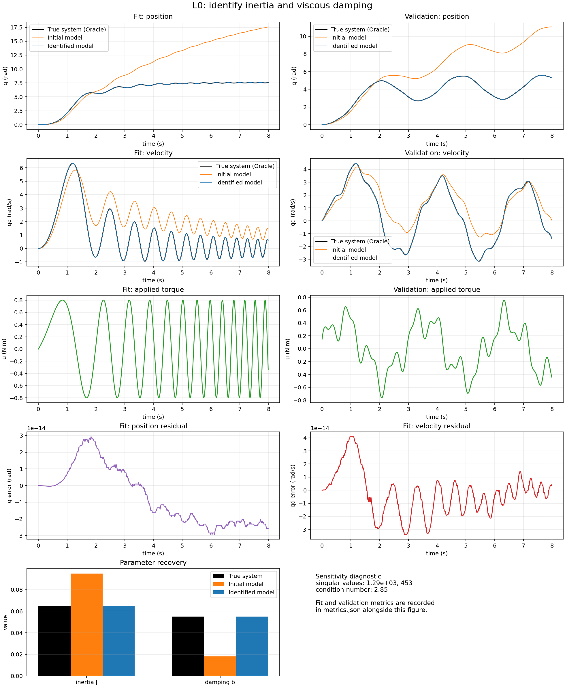

# L0 · Estimate joint inertia and damping

Our first experiment starts with one rotating joint. We will estimate its inertia and damping from experimental data, then test the resulting model on a new motion.

We will follow the initial mismatch through fitting and validation to see what the data tells us. If inputs, observations, and parameters are still unfamiliar, start with [K1 · System identification fundamentals](../k1/index.md).

## Start with an inaccurate model {#mismatch}

Why would a joint and its model move differently when they receive the same torque? The model's parameters may simply be inaccurate.

In this clip, white represents the system producing the observations and orange represents the initial model. Watch their positions, then compare the velocity bars on the shared scale.

<figure class="clip"><video controls="" playsinline="" poster="../../../demos/manim/rendered/l0-mismatch.png" preload="metadata"><source src="../../../demos/manim/rendered/l0-mismatch.mp4" type="video/mp4"/><track default="" kind="subtitles" label="English" src="../../site/subtitles/l0-mismatch.en.vtt" srclang="en"/><track kind="subtitles" label="中文" src="../../site/subtitles/l0-mismatch.zh-CN.vtt" srclang="zh-CN"/></video><figcaption>What does the mismatch look like?</figcaption><details><summary>Read the video explanation</summary><p>One equation: J qdd + b qd = u. Compare the True system and Initial model.</p><p>The same applied torque drives both systems. White is truth; orange is the Initial model.</p><p>The velocity meters share a scale. Incorrect damping produces a visibly different response.</p></details></figure>

We want to use the recorded motion to improve the parameters. To find out whether the improvement is useful, the model must also predict a motion withheld from fitting.

## How the joint moves {#boundary}

The experiment starts with known applied torque and records angular position and velocity. The model includes inertia and viscous damping:

$$
J\ddot q+b\dot q=u
$$

$q$ is angular position in rad, $\dot q$ is angular velocity in rad/s, and $\ddot q$ is angular acceleration. $u$ is applied torque in N m. The unknown parameters are inertia $J$ in kg m² and damping $b$ in N m s/rad.

Inertia determines how strongly the joint resists acceleration. Viscous damping determines the resisting torque at a given speed. For example, with speed and damping held fixed, increasing inertia gives less acceleration for the same net torque.

This experiment omits gravity, non-viscous friction, and sensor noise. The system generating the data and the fitted model use the same equation. We know the true parameters for checking the answer; fitting receives time, torque, position, velocity, and the parameter bounds and initial guess chosen beforehand.

## Choose motions that reveal the parameters {#data}

We prepare two different inputs before fitting. One estimates the parameters; the other checks prediction afterward.

| Data | Applied torque | Purpose |
|---|---|---|
| Fit | A sinusoid with increasing frequency, called a chirp | Estimate inertia and damping |
| Validation | Several fixed-frequency sinusoids added together, called a multisine | Check prediction on a different motion |

The chirp provides slower and faster motion to help separate inertia and damping effects. The validation input uses another combination of frequencies to test whether the estimated parameters explain a new motion. Both runs start from the same specified initial state.

## Fit the parameters to the data {#fit}

The fitting program tries values of $J$ and $b$, predicts position and velocity, and compares them with the observations. It adjusts the parameters to reduce the error.

First compare the predictions before and after fitting. Orange is the initial model; blue is the identified model. The blue curve approaches the true system, showing that the fitting motion is now reproduced closely.

<figure class="clip"><video controls="" playsinline="" poster="../../../demos/manim/rendered/l0-fit-lands.png" preload="metadata"><source src="../../../demos/manim/rendered/l0-fit-lands.mp4" type="video/mp4"/><track default="" kind="subtitles" label="English" src="../../site/subtitles/l0-fit-lands.en.vtt" srclang="en"/><track kind="subtitles" label="中文" src="../../site/subtitles/l0-fit-lands.zh-CN.vtt" srclang="zh-CN"/></video><figcaption>Did fitting actually fix it?</figcaption><details><summary>Read the video explanation</summary><p>Fit inertia J and damping b from observations, then compare position error.</p><p>Orange is the Initial model; blue is the Identified model. Curves share an axis.</p><p>The identified trace overlaps truth, supporting this fit. Held-out validation is still needed.</p></details></figure>

The next clip shows the parameter updates. The left side displays loss for different parameter values; the right side shows the corresponding motion. Follow an arrow and watch how the predicted curve approaches the observations.

<figure class="clip"><video controls="" playsinline="" poster="../../../demos/manim/rendered/l0-fit-walk.png" preload="metadata"><source src="../../../demos/manim/rendered/l0-fit-walk.mp4" type="video/mp4"/><track default="" kind="subtitles" label="English" src="../../site/subtitles/l0-fit-walk.en.vtt" srclang="en"/><track kind="subtitles" label="中文" src="../../site/subtitles/l0-fit-walk.zh-CN.vtt" srclang="zh-CN"/></video><figcaption>How does the fit get there?</figcaption><details><summary>Read the video explanation</summary><p>Left: loss across J and b. Right: the corresponding model position trace.</p><p>Arrows connect accepted optimizer iterates; color represents loss.</p><p>As parameters move, compare the current model with the recorded truth.</p><p>The final model approaches truth. This path explains one fit, not universal convergence.</p></details></figure>

These are the parameters from the recorded run. The true values are shown only to check the result.

| quantity | True system | Initial model | Identified model |
|---|---:|---:|---:|
| inertia `J` (kg m^2) | 0.06500000 | 0.09500000 | 0.06500000 |
| damping `b` (N m s/rad) | 0.05500000 | 0.01800000 | 0.05500000 |

## Try other starting guesses {#starts}

A successful fit may depend on its starting point. We repeat the same estimation process from nine initial guesses and check whether they reach the same solution.

<figure class="clip"><video controls="" playsinline="" poster="../../../demos/manim/rendered/l0-fit-robust.png" preload="metadata"><source src="../../../demos/manim/rendered/l0-fit-robust.mp4" type="video/mp4"/><track default="" kind="subtitles" label="English" src="../../site/subtitles/l0-fit-robust.en.vtt" srclang="en"/><track kind="subtitles" label="中文" src="../../site/subtitles/l0-fit-robust.zh-CN.vtt" srclang="zh-CN"/></video><figcaption>Was that one lucky start?</figcaption><details><summary>Read the video explanation</summary><p>One successful fit may depend on the start. Compare nine starting guesses.</p><p>All paths use the same data, model, and public parameter bounds.</p><p>Reaching the same solution supports convergence for this problem, not held-out validation.</p></details></figure>

These starts converge to the same result, supporting stable fitting for the starting guesses tested here. We still need to check a new motion: convergence from several starts alone cannot establish prediction performance.

## Check predictions on a new motion {#validation}

Now freeze the identified parameters and apply the reserved multisine torque. These observations were used neither to fit nor to select parameters.

[](../../../reports/l0_inertia_damping/report.png)

Start with the first two rows: Fit on the left and Validation on the right, comparing position and velocity. Dark solid lines represent the true system, orange the initial model, and blue dashed lines with hollow markers the identified model. Click the image to inspect it at full size.

The third row shows the applied torques. Both residual plots in the fourth row use fitting data: position on the left and velocity on the right. Parameter comparisons appear at the bottom.

The table reports mean absolute error (MAE) for position `q` and velocity `qd`. Lower values mean smaller average deviations. The earlier videos use root mean square error (RMSE), which places more weight on larger deviations; check the metric label when comparing values.

| split/model | q MAE (rad) | qd MAE (rad/s) |
|---|---:|---:|
| fit / Initial model | 4.3107227 | 1.4136074 |
| fit / Identified model | 1.5607874e-14 | 1.2252942e-14 |
| validation / Initial model | 2.7396426 | 0.87716149 |
| validation / Identified model | 1.8251542e-14 | 2.0286828e-14 |

The identified model also improves substantially on validation. This answers our opening question: the two estimated parameters predict the new motion held out in this experiment.

A **residual** in this report is the model prediction minus the observation. The fourth-row position and velocity residuals stay near zero, consistent with the fitting errors in the table. Errors around $10^{-14}$ are possible because this example uses matching equations and ideal observations, leaving only tiny numerical differences after fitting. Real measurements usually do not behave this way.

## Think it through, then check the evidence {#exercise}

1. With speed and damping unchanged, does greater inertia give faster or slower acceleration under the same net torque?
2. What evidence would be missing if we showed only the fitting curves on the left?
3. If fitting looked good but validation error were large, what would you check next?

<details markdown="1">
<summary>Read suggested answers</summary>

Greater inertia gives less acceleration. Fitting curves show how well the model matches its tuning data; we also need a motion withheld from adjustment.

If validation is poor, try other starting guesses to check fitting stability. Then examine whether the input exposed the parameter effects and whether the model omitted an important effect. Also check initial states, units, and input definitions across datasets. Once validation results guide a change, reserve new data for the final evaluation.

</details>

If the curves look identical, check the input and observation columns before trusting the parameter values. Continue when you can state which result is fit evidence and which result is held-out evidence.

## Understand the conditions behind the result {#limits}

With known applied torque, ideal observations, and a correct model structure, we recovered inertia and damping and predicted motion under another input.

Real joints may also involve controllers, delay, torque limits, other friction, compliance, and measurement noise. These require another look at the model and experiment. [L1 · Estimate command delay from motion](../l1/index.md) adds a position controller and one unknown delay to study a timing effect that a drawing cannot reveal.

## Optional: run the experiment yourself {#local-experiment}

To change parameters and compare another run, use these commands from the repository root. The experiment runs on a CPU. The first two commands install dependencies and generate a report; the last opens the local interactive app.

```bash
python -m pip install -r requirements-interactive.txt
python -m synthetic.l0_inertia_damping --output-dir reports/l0_inertia_damping
python -m marimo run apps/l0_inertia_damping.py --host 0.0.0.0 --port 2718
```

Change the initial damping in the app. Predict how the orange curve will move before checking its preview. Blue still represents the previous fit; press **Run identification** before comparing the new result and validation error.

For further detail, read the [full experiment report](../../../reports/l0_inertia_damping/report.md), open the [supplementary notes and code links](README.md), or download the [notebook](../../../notebooks/l0_inertia_damping.ipynb).
