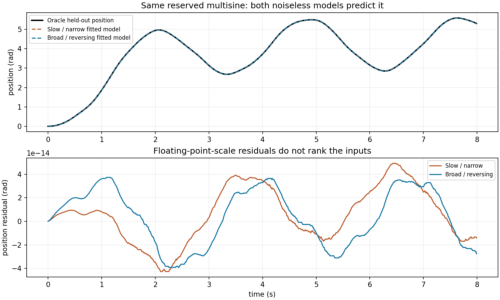

# L0-E · 激励与参数分离

这份固定无噪声对比中，**两种输入都恢复了两个参数**。宽频输入改善局部分离程度（条件数 11.81 → 1.90），但弱方向没有让慢输入拟合失败。Oracle J = 0.065 kg m²、b = 0.055 N m s/rad 只用于评估。

## 契约与复现

首次执行 `python -m pip install -r requirements.txt` 安装依赖，然后在仓库根目录运行 `python -m synthetic.l0_excitation --output-dir reports/l0_excitation`。这个命令仅发布已审定的固定实验；自定义配置需要另行修订课程与报告。固定配置为 [l0_excitation_config.json](../../synthetic/l0_excitation_config.json)，[metrics.json](metrics.json) 保存完整轨迹、损失网格、敏感度列和每组起点/结果。两份记录都是 0.01 s 采样、8 s 预算、800 个样本，q(0)=qd(0)=0，采样力矩峰值恰好为 0.8 N m。0.005–0.015 Hz 输入是缓慢上升的部分正弦周期；0.15–3 Hz 扫频包含换向。每个采样波形除以自己的峰值，再乘以 0.8。相同峰值与时长不代表相同力矩 RMS、频率内容或运动范围。这里的大转角只适用于无关节限位、无重力的理想转子。

复用 L0 的精确零阶保持仿真器和有界 TRF 最小二乘设置。公共边界为 J ∈ [0.01, 0.15]、b ∈ [0.000001, 0.2]，公共初始模型为 (0.095, 0.018)。L0 按每份数据的标准差归一化；L0-E 为保证公平比较，把**两次**输出尺度都固定为公开的 1 rad 和 1 rad/s。代价为尺度化位置/速度残差平方和的一半。没有加入噪声或模型失配。

频率预设和尺度仅根据拟合数据的覆盖与敏感度冻结，未用最终分数选择。全部拟合和诊断完成后才生成留出观测。沿用 L0 已声明多正弦：频率 [0.35, 1.3, 2.7] Hz、幅值 [0.45, 0.22, 0.1] N m、相位 [0, 0.3, 1] rad。运行器不进行自适应开发或最终结果调参。如果未来用本结果选择设置，必须另留新的最终评估。

## 覆盖与局部敏感度

每列从上到下读：力矩、速度/加速度覆盖、输出敏感度。紫色是 J，绿色是 b；实线对应位置，虚线对应速度。加速度是 Oracle 评估诊断，不进入拟合。两列敏感度都在拟合参数处用中心差分计算。参数尺度取公开初始模型 (0.095, 0.018)，输出尺度为 (1, 1)。对尺度化输出 Jacobian 除以 sqrt(2N) 后求奇异值，避免仅由样本数放大诊断值；图中显示除以 sqrt(2N) 前的逐样本列。这是局部条件性诊断，不是统计不确定度。

| Input / 输入 | velocity / 速度 (rad/s) | accel RMS / 加速度 (rad/s²) | σ min | κ | J, b | held-out q RMSE / 留出 (rad) |
|---|---:|---:|---:|---:|---:|---:|
| Slow / narrow | 0.000 … 11.763 | 1.609 | 0.494 | 11.81 | 0.06500000, 0.05500000 | 2.37e-14 |
| Broad / reversing | -0.953 … 6.324 | 8.470 | 1.218 | 1.90 | 0.06500000, 0.05500000 | 2.39e-14 |

## 目标函数与多初始点

图中数值为 sqrt(mean(尺度化残差²))；机器可读网格还包含优化器代价的 log10。两轴是相对各自拟合点的偏移，除以相同公开参数尺度，因此长宽比可以比较。比较相同等高线级别。细长谷说明局部分离较弱，不等于存在完全平坦、不可辨识的方向。

空心圆是预先声明的九个起点，黑星是仅用于评估的 Oracle 参数。直线连接起点和最终估计，**不是**优化迭代路径。18 次拟合全部成功，J 与 b 的相对误差均低于 1e-8。这只支持已测起点，不保证普遍收敛。

## 最终留出预测

两种输入的留出位置 RMSE 都小于 1e-9 rad。微小差别属于数值精度，不能据此宣布某种输入预测更好。噪声或模型失配可能改变结果，但属于其他实验。决定下一次采集时应看敏感度与覆盖，不能把未发生的慢输入失败写成结论。

## 资源

仅 CPU，无需下载数据或 GPU。[runtime.json](runtime.json) 记录完整报告运行的实测耗时、进程峰值 RSS、Python/NumPy/SciPy 版本和机器架构。为这个本地小实验预留 60 秒、512 MiB；实测值随机器变化。独立学习者验收与硬件迁移仍未验证。
