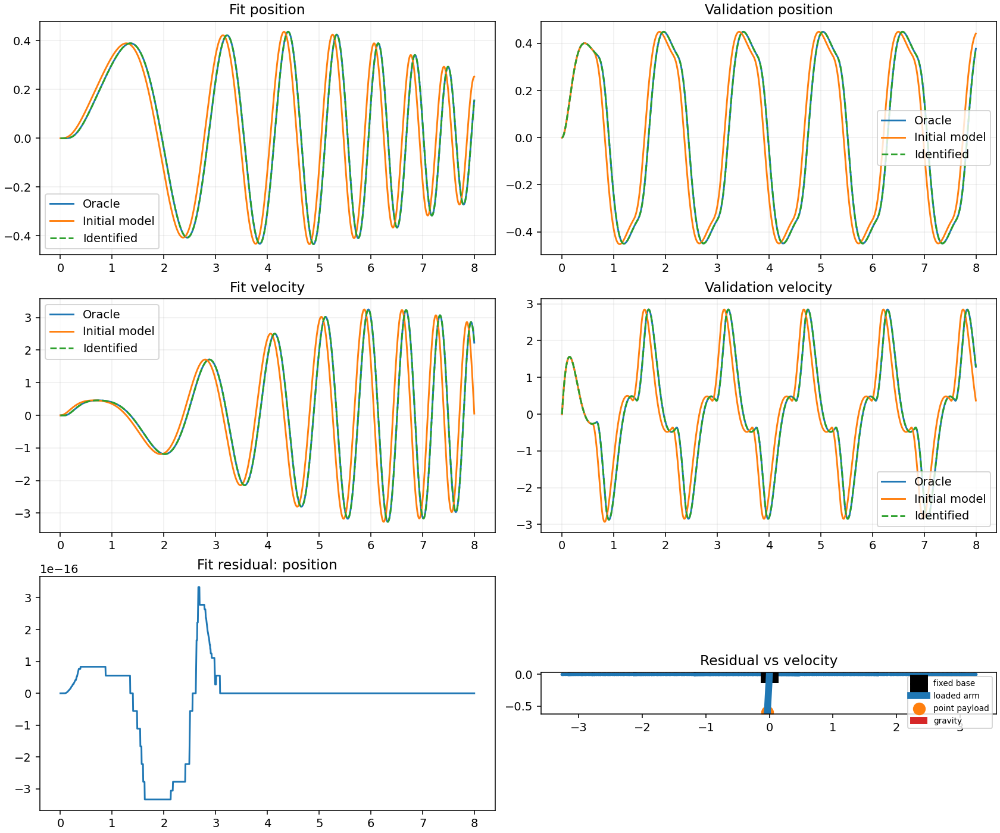

# L1 Servo Driven Loaded Pendulum

This synthetic ideal experiment uses a fixed base, a uniform rigid arm (mass 1.2 kg, length 0.6 m), a known point payload (0.35 kg), gravity, and a fixed PD position servo. The declared boundary is `q_des -> PD -> effective command delay -> pendulum torque`; delay is applied after the PD law with fractional interpolation and zero prehistory.

The Oracle delay is **0.080 s**. The Initial model fixes delay at **0.000 s**. The Identified Student fits only `t`, `q_des`, `q`, and finite-difference `qd` from fit data, recovering **0.080 s**. On held-out validation, q RMSE changes from **0.0308547** to **6.00653e-17** (100.0% improvement).

Torque, pre-delay command, raw integration velocity, and delayed state are Oracle diagnostics and never estimator inputs. Residuals expose phase/tracking error from the omitted delay; fit and validation use separate reset trajectories. The fitted value is an effective parameter dependent on this command boundary and sampling.

Omitted effects include friction, saturation, compliance/backlash, sensor noise, voltage and thermal behavior, contacts, payload shifts, and whole-robot dynamics. This is not a motor-electromagnetic or hardware-transfer model.

| Role | Delay | Mechanical parameters |
|---|---:|---|
| Oracle | hidden 0.080 s | known arm + payload |
| Initial Student | fixed 0.000 s | known arm + payload |
| Identified Student | fitted 0.080 s | known arm + payload |

Acceptance thresholds are delay error <= 1 ms and held-out q/qd RMSE improvement >= 90%. A local loss slice around the fitted delay is recorded in `metrics.json` to show the identification minimum. Run metadata, units, seed, reset state, excitation definitions, configuration hash, and numerical settings are recorded in `metrics.json`. Read the [guided lesson](../../docs/lessons/l1/README.md) for the learner exercise.
